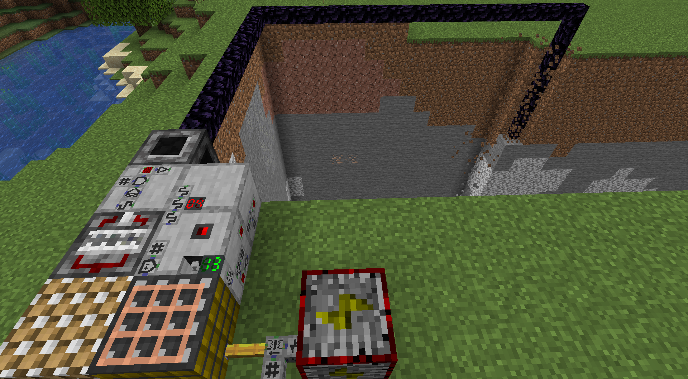

This is the Minecraft 1.16 port of my previous mod [Redstone Control](https://github.com/CD4017BE/RedstoneControl), but everything is microblocks now.

**RedstoneControl2** uses my new microblock system in [CD4017BE_lib](https://github.com/CD4017BE/CD4017BE_lib) to add miniature logic gates, arithmetic operators and control interface elements (switches, lamps, 7-segment display) for Redstone Signals to Minecraft. To give you something to control with all the fancy circuitry, it also comes with its own microblock based Item, Fluid and Energy transport systems and machines. And a remote Block Interaction system allows devices like `Block Breakers` to operate not just on the block in front of them, but on blocks selected by `Interaction Pipe Drivers` (extends a controllable pipe) or `Random Block Access Controllers` (select blocks inside a marked cubiod region). Offering countless automation possibilities and alongside circuit engineering challenges.

To not put unnecessary burden on your CPU, the microblocks are hosted by non-ticking TileEntities and have **zero** idle¹ performance impact (they only cost RAM). Microblock devices also communicate directly without block updates, so even complicated active microblock circuits often have a much lower server performance impact than just a single piece of redstone dust being pulsed.  
*¹: idle includes decorative structures, logic gates in a stable state and inactive machines.*

## Server/Client Installation
Simply put the downloaded `.jar` files of the mod and the required verison of CD4017BE_lib in your `mods` folder. Requires Forge Modloader to be installed in your Minecraft instance.

Also highly recommended to install the mod [Patchouli](https://minecraft.curseforge.com/projects/patchouli) which is required to access the **Redstone Control Manual** in-game.

Latest development downloads can be found in [packages](https://github.com/CD4017BE/RedstoneControl2/packages/914303).
Stable, more thoroughly tested downloads available on [Curse Forge](https://www.curseforge.com/minecraft/mc-mods/redstone-control-2).

## Data Packs
All crafting recipes of this mod can be changed with data packs in the usual way.

In addition to that, this mod adds a [new advancement trigger](src/main/resources/data/rs_ctr2/circuit_test/README.md) that is used by default to unlock crafting recipes for circuit components via the `Redstone Research Lab`. But modpack and map creators can make use of this trigger as well and add their own tests if they want to lock certain progression or rewards behind circuit engineering challenges.

## Project Setup
The setup is the same as for [CD4017BE_lib](https://github.com/CD4017BE/CD4017BE_lib#project-setup-for-mc-1165).
Gradle will require GitHub authentication for downloading the CD4017BE_lib dependencies [as described here](https://github.com/CD4017BE/CD4017BE_lib#using-this-mod-as-dependency-1165).
